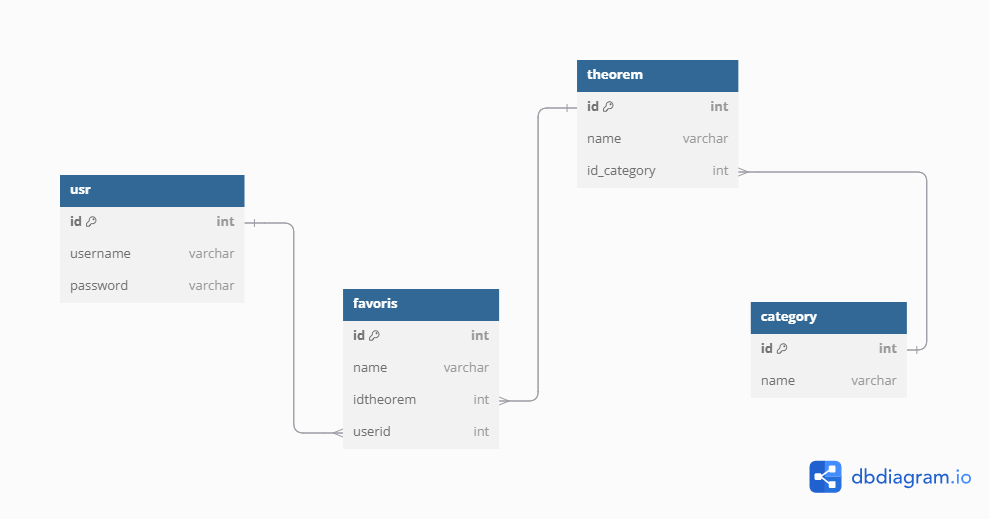

# Math Easy Documentation

## Introduction
Math Easy is an educational web application that helps users learn and explore various mathematical concepts, including theorems, rules, and equations, categorized by topics. It provides tools like a calculator, user identification, favorites, history search, and more to enhance the learning experience.

## Features
### 1. **Math Topics**
The project includes the following categories:
- **Linear Algebra**
- **Conic**
- **Calculus**
- **Trigonometry**
- **General Maths**
- **Graphs/Shapes**
- **Equations**
- **Binary**
- **Complex**
- **Probability**
- **Mensuration**

Each category contains calculators, equations, theorems, and rules relevant to that specific topic.

### 2. **User Authentication**
Users can sign up and log in to save their preferences, access history, and add topics to their favorites.

### 3. **Favorites and History**
Users can save frequently visited topics in their "Favorites" section for quick access. A history feature allows users to revisit previously explored topics.

### 4. **Calculator**
Math Easy includes various calculators to help users solve mathematical problems in each category.

---

## Frontend
### Technologies Used
- **HTML/CSS**: Basic structure and styling.
- **JavaScript**: Interactivity and functionality.
- **Bootstrap**: Grid system and responsive design.

### Layout and Design
- The home page displays a menu with all the categories listed. Each category has its own section with an icon and the number of calculators available.
- Users can click on a category to open the specific page with the available calculators.


### Styles
- **Menu**: Displays all topics as clickable options.
- **Icons**: Represent each category with images.
- **Responsive Design**: Adjusts the layout based on screen size using Bootstrap's grid system.

---

## Backend
### Technologies Used
- **Node.js**: Server-side functionality.
- **Express.js**: Backend routing and API handling.
- **MongoDB**: Database for storing user information, favorites, and history.

---

## Database Structure 
### User Schema
- **MongoDB** for storing user data




## Installation

To get started with the project, follow these steps:

1. **Clone the repository:**

```bash
git clone <repository_url>  
cd <project_directory>
```
---
## Contribution
To contribute to Math Easy, please fork the repository, make changes, and submit a pull request.
